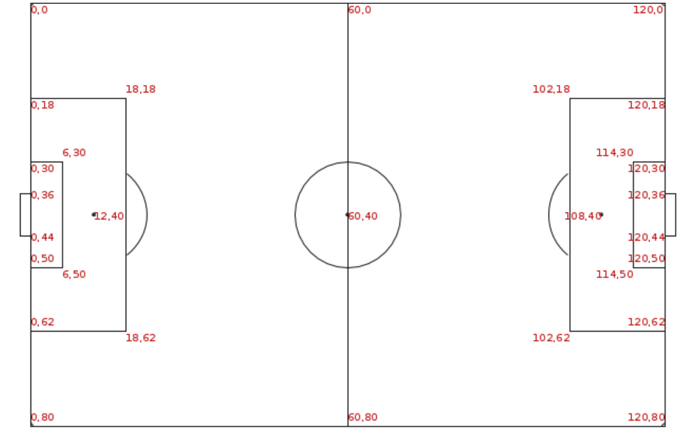

# Dataset Creation based on public data provided by StatsBomb

***

## Step by step to create the dataset from Statsbomb Open-data

You will need to clone both my repository and Statsbomb open-data repository. Due to copyright policies, I cannot provide the dataset I created nor the original public data from Statsbomb directly.
```
git clone https://github.com/Gabrielcouto1/soccer-shots-dataset-creation
```
```
git clone https://github.com/statsbomb/open-data/
```

The first step is to copy the necessary JSON files to create the dataset. I created two python scripts to easily select all data available from the five big Europe Leagues: 'Bundesliga', 'La Liga', 'Ligue 1', 'Premier league' and 'Serie A'.
To do this, move to the python scripts directory: 

```
cd soccer-shots-dataset-creation/python/
```

First run the script to copy the matches list for each season of each 5 competitions:

```
python3 copy_matches_lists.py 
```

Now, with the matches list, you will run the script to collect each match's JSON. It will take from 20-30 minutes.

```
python3 copy_interested_matches.py
```

Now, if you want, you can exclude Statsbomb's open-data repository, since it's quite large (18GB+):
```
cd ..
cd ..
rm -rf open-data
```
***

### Executing the R script
Now that you have all files necessary copied to your folder, you can execute the file "r/create_dataset" on a R interpreter or in RStudio.
**The script uses relative paths, so it is crucial to set the working directory of your R interpreter to the root of the 'soccer-shots-dataset-creation' repository.**
After executing this file, you will have all datasets in the folder 'datasets'. 

| File Name                             | Description                                                                       | Number of matches processed | Number of shots (rows) | Number of columns |
| :------------------------------------ | :-------------------------------------------------------------------------------- | :-------------------------- | :--------------------- | :---------------- |
| `datasets/bundesliga_shots.csv`       | Dataset of all shots taken in available Bundesliga matches.                       | 340                         | 8.747                  | 40                |
| `datasets/la_liga_shots.csv`          | Dataset of all shots taken in available La Liga matches.                          | 867                         | 21.182                 | 40                |
| `datasets/ligue_1_shots.csv`          | Dataset of all shots taken in available Ligue 1 matches.                          | 435                         | 10.346                 | 40                |
| `datasets/premier_league_shots.csv`   | Dataset of all shots taken in available Premier League matches.                   | 418                         | 10.837                 | 40                |
| `datasets/serie_a_shots.csv`          | Dataset of all shots taken in available Serie A matches.                          | 381                         | 10.033                 | 40                |
| `datasets/shots.csv`                  | Dataset of all shots taken in all 5 competitions, combined into this single file. | 2.441                       | 61.145                 | 40                |

***

## Data Dictionary


This table provides a detailed description of each column in the datasets.

| Column Name                   | Description                                                                                                                                     | Data Type         | Possible Values                                                                                                   |
| :---------------------------- | :---------------------------------------------------------------------------------------------------------------------------------------------- | :---------------- | :---------------------------------------------------------------------------------------------------------------- |
| `competition`                 | The league or competition the shot belongs to.                                                                                                  | String            | e.g., 'Bundesliga', 'La Liga', 'Ligue 1', 'Premier league', 'Serie A'                                             |
| `season`                      | The season in which the shot's match was played.                                                                                                | String            | e.g., '2015-2016', '2022-2023'                                                                                    |
| `match_id`                    | A unique identifier for the match the shot was taken.                                                                                           | Integer           | Any unique integer.                                                                                               |
| `timestamp`                   | The time of the shot event within the match in seconds.                                                                                         | Integer           | Any non-negative integer.                                                                                         |
| `period`                      | The period of the match when the shot occurred.                                                                                                 | Integer           | `1` (First Half), `2` (Second Half)                                                                               |
| `seconds_since_previous_shot` | Time in seconds passed since previous shot.                                                                                                     | Integer or NA     | Any non-negative integer. If it's NA, it means there were no shots previous to this.                              |
| `attacking_team`              | The team that took the shot.                                                                                                                    | String            | Name of a football team.                                                                                          |
| `defending_team`              | The team that is defending against the shot.                                                                                                    | String            | Name of a football team.                                                                                          |
| `is_home`                     | Indicates if the attacking team is the home team.                                                                                               | Integer (Boolean) | `1` for home team, `0` for away team.                                                                             |
| `shooter_namr`                | The name of the player who took the shot.                                                                                                       | String            | e.g., 'Lionel Messi', 'Cristiano Ronaldo'                                                                         |
| `shooter_position`            | Indicates the shooter main playing position.                                                                                                    | String            | e.g., 'Goalkeeper'. Check appendix A.                                                                             |
| `shot_dist`                   | The distance the ball traveled from the place the shot was taken.                                                                               | Float             | Any positive floating-point number.                                                                               |
| `x_position`                  | The x position of the place the shot was taken. (The field follows the proportions and dimmensions seen in Appendix B)                          | Float             | Any positive floating-point number.                                                                               |
| `y_position`                  | The y position of the place the shot was taken. (The field follows the proportions and dimmensions seen in Appendix B)                          | Float             | Any positive floating-point number.                                                                               |
| `x_end_position`              | The x position of the place the shot finished at. (The field follows the proportions and dimmensions seen in Appendix B)                        | Float             | Any positive floating-point number.                                                                               |
| `y_end_position`              | The y position of the place the shot finished at. (The field follows the proportions and dimmensions seen in Appendix B)                        | Float             | Any positive floating-point number.                                                                               |
| `dist_to_goal`                | The distance from the shot event to the goal line in meters.                                                                                    | Float             | Any positive floating-point number.                                                                               |
| `shot_angle`                  | The angle of the shot in relation to the goal posts, in degrees. Check Appendix B.                                                              | Float             | A float, typically between 0 and 180.                                                                             |
| `body_part`                   | The body part used to take the shot.                                                                                                            | String            | e.g., 'Right Foot', 'Left Foot', 'Head', 'Other'.                                                                 |
| `shot_technique`              | The technique used for the shot.                                                                                                                | String            | e.g., 'Backheel', 'Diving Header', 'Half Volley', 'Lob', 'Normal', 'Overhead Kick', 'Volley'.                     |
| `shot_type`                   | The type of play leading to the shot.                                                                                                           | String            | e.g., 'Open Play', 'Penalty', 'Free Kick', 'Corner', 'Kick Off'.                                                  |
| `is_ca`                       | Indicates if the shot was the result of a counter-attack.                                                                                       | Integer (Boolean) | `1` for yes, `0` for no.                                                                                          |
| `is_from_cross`               | Indicates if the final pass before the shot was a cross.                                                                                        | Integer (Boolean) | `1` for yes, `0` for no.                                                                                          |
| `is_under_pressure`           | Indicates if the creator of the final pass before the shot was under significant pressure from an opponent.                                     | Integer (Boolean) | `1` for yes, `0` for no.                                                                                          |
| `is_penalty`                  | Indicates if the shot was a penalty.                                                                                                            | Integer (Boolean) | `1` for yes, `0` for no.                                                                                          |
| `is_open_goal`                | Indicates if the shot was taken with an open goal.                                                                                              | Integer (Boolean) | `1` for yes, `0` for no.                                                                                          |
| `is_first_time`               | Indicates if the shot was taken with only one touch by the shooter.                                                                             | Integer (Boolean) | `1` for yes, `0` for no.                                                                                          |
| `is_one_on_one`               | Indicates if the shooter was in a one-on-one situation with the goalkeeper.                                                                     | Integer (Boolean) | `1` for yes, `0` for no.                                                                                          |
| `is_aerial_win`               | Indicates if the shooter was in a aerial duel and won it.                                                                                       | Integer (Boolean) | `1` for yes, `0` for no.                                                                                          |
| `teammates_in_frame`          | The number of teammates visible in the frame when the shot was taken.                                                                           | Integer           | Any non-negative integer.                                                                                         |
| `opponents_in_frame`          | The number of opponents visible in the frame when the shot was taken.                                                                           | Integer           | Any non-negative integer.                                                                                         |
| `closest_opponent_dist`       | The distance to the closest opponent at the time of the shot in meters.                                                                         | Float             | Any positive floating-point number.                                                                               |
| `goalkeeper_dist`             | The distance of the goalkeeper from the shot location in meters.                                                                                | Float or NA       | Any positive floating-point number. If it's NA, it indicates that the goalkeeper is not in the shot frame.        |
| `goalkeeper_position`         | Name for the attribute option of goalkeeper's positioning before a shot.                                                                        | String or NA      | e.g., 'Moving', 'Prone', 'Set'.     If it's NA, it indicates that the goalkeeper is not in the shot frame.        |
| `opponents_in_penalty_area`   | The number of opponents inside the penalty area.                                                                                                | Integer           | Any non-negative integer.                                                                                         |
| `opponents_in_goal_area`      | The number of opponents inside the goal area.                                                                                                   | Integer           | Any non-negative integer.                                                                                         |
| `opponents_in_shot_path`      | The number of opponents inside the triangle traced from the place the shot was taken and the two goal posts. Check Appendix C.                  | Integer           | Any non-negative integer.                                                                                         |
| `statsbomb_xg`                | The Expected Goals (xG) provided by Statsbomb. This represents the probability of a shot resulting in a goal based on historical data.          | Float             | A float between 0 and 1.                                                                                          |
| `outcome`                     | The outcome, result of the shot.                                                                                                                | String            | e.g., 'Blocked', 'Goal', 'Off T', 'Post', 'Saved', 'Wayward', 'Saved Off T', 'Saved To Post'.                     |
| `is_goal`                     | Indicates if the shot resulted in a goal.                                                                                                       | Integer (Boolean) | `1` for a goal, `0` for no goal.                                                                                  |

*** 
# Appendix A
### Possible positions in column `shooter_position`
| Position Number | Position Abbreviation | Position Name             |
|:--------------- |:--------------------- |:------------------------- |
| 1               | GK                    | Goalkeeper                |
| 2               | RB                    | Right Back                |
| 3               | RCB                   | Right Center Back         |
| 4               | CB                    | Center Back               |
| 5               | LCB                   | Left Center Back          |
| 6               | LB                    | Left Back                 |
| 7               | RWB                   | Right Wing Back           |
| 8               | LWB                   | Left Wing Back            |
| 9               | RDM                   | Right Defensive Midfield  |
| 10              | CDM                   | Center Defensive Midfield |
| 11              | LDM                   | Left Defensive Midfield   |
| 12              | RM                    | Right Midfield            |
| 13              | RCM                   | Right Center Midfield     |
| 14              | CM                    | Center Midfield           |
| 15              | LCM                   | Left Center Midfield      |
| 16              | LM                    | Left Midfield             |
| 17              | RW                    | Right Wing                |
| 18              | RAM                   | Right Attacking Midfield  |
| 19              | CAM                   | Center Attacking Midfield |
| 20              | LAM                   | Left Attacking Midfield   |

***
# Appendix B
## Field Dimensions


***
# Appendix C
## `Shot Angle`
Suppose the Red dot is the location the shot was taken. Draw two lines going to each one of the goal posts. The α is the shot angle.

 
***
# Appendix D
### `Opponents in shot path`
The variable opponents in shot path counts how many enemy players are there in the area of the triangle drawn in appendix B.
The opponents in the shot path are the cyan points. They are inside the area of the projected triangle. 


In this example, the value for `opponents_in_shot_path` would be 4.